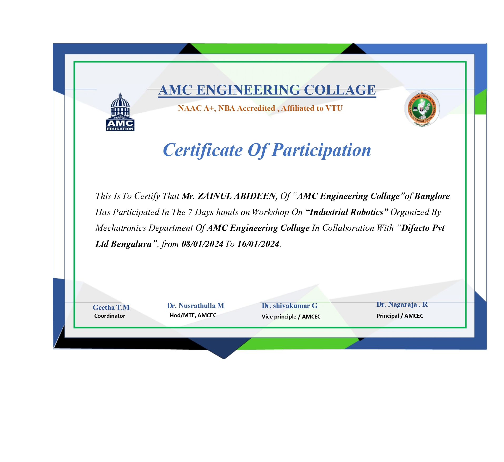
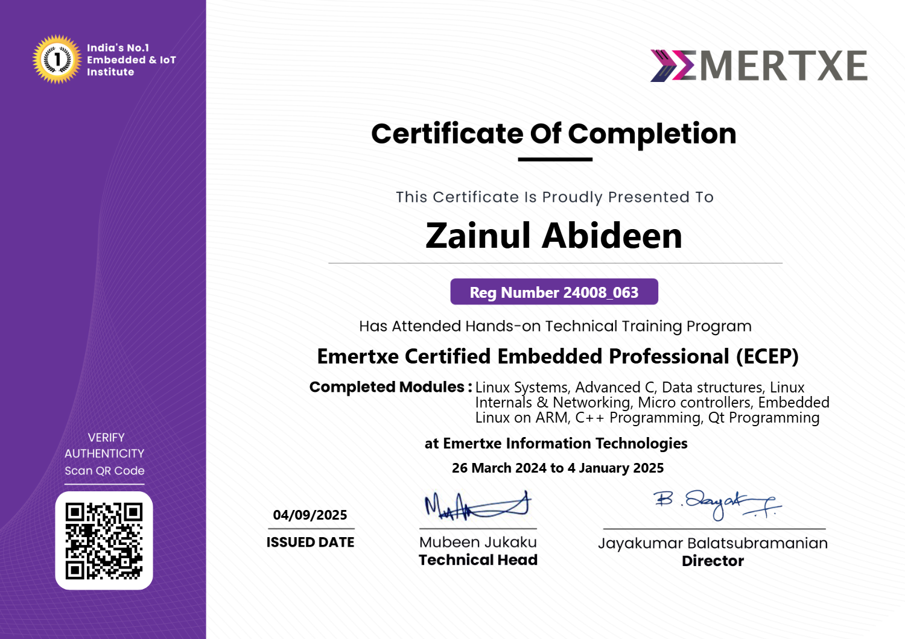
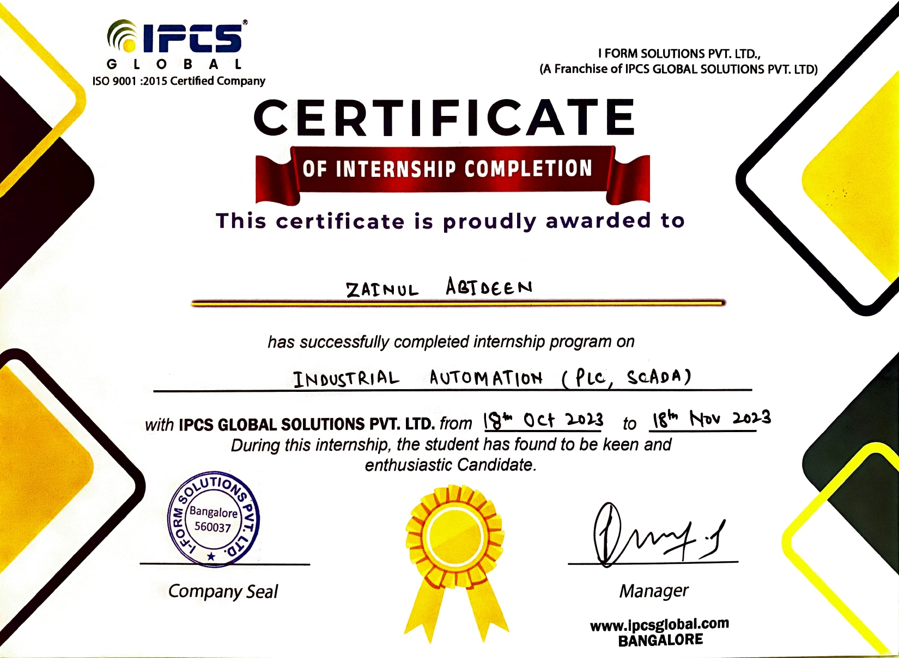
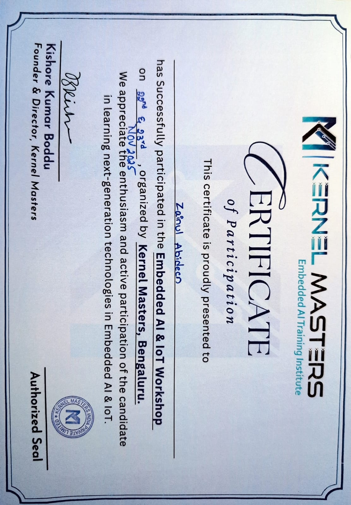

# 🎓 My Certificates

Here are some of the certificates I have earned from online courses and training:

### 🏆 Certificate — Deloitte Australia

### 🏆 Certificate — Difacto

### 🏆 Certificate — Emertxe Training

### 🏆 Certificate — IPCS Global

### 🏆 Certificate — Kernel Masters

---

## 📌 About

These are certificates I have completed as part of my learning journey in embedded systems, software development, and professional trainings.

**Zainul Abideen**  
Embedded Systems & Software Engineer
